# Note

记录整个tutorial过程中学到的新知识

Todo部分通过GitHub中的issue形式保留, 将会从Note和代码文件中移植Todo

## Tutorial1: win32 API

* 使用VS自带的GitHub扩展进行版本控制

详情可参见链接: <https://zhuanlan.zhihu.com/p/31031838>

* 在已经创建的项目中可以使用扩展来在GitHub上创建新的仓库也可以在创建项目的开始就与远端同步

* VS对应的切换到下一行空行的快捷键是ctrl+shift+enter,与VS Code中的ctrl+enter功能一样

## Tutorial2: Initializing Direct3D 11

* 双缓冲: 为了解决窗体进行复杂图像处理后,屏幕在重绘时由于过频的刷新引起闪烁的问题
  * 内存上创建一个与显示控件相同大小的画布,在画布上完成绘制后使用画布覆盖显示控件以达到显示一次则刷新一次
* 三缓冲: 双缓冲存在显示控件等待后台屏幕绘制的过程,三缓冲(以及更高的多重缓冲)解决这个问题,做到更低时延
  * 两个后置缓存(backBuffer)后台绘制,显示控件读取前置缓存,前置缓存读取后置缓存,由于有两个后置缓存,所以前置缓存无需等待
  * 第二种方法:三个缓存相当于三个交换链,以队列的方式(先进先出)依次绘制-被读取
* rgba色彩管理: 比rgb多一个a, 代表Alpha, 控制透明度
* __uuidof: 用来获取 某种结构、接口及其指针、引用、变量 所关联的GUID,类袭似于某些语言百中获取类型 typeof 这样的操作。
* SwapChain: 交换链技术,与三重缓冲的对比详见<https://zhuanlan.zhihu.com/p/104244526>
* 各个图形厂商都有自己对渲染的优化, 要具体情况具体写
* 直接在程序中编写错误抛出有助于快速定位error, 也能解决一些意想不到的bug
  * 通过查看HRESULT(句柄返回结果), 可以判断函数运行情况
    * S_OK: 运行成功
    * E_NOTIMPL: 函数未实现
    * E_NOINTERFACE: 接口不支持
    * E_ABORT: 中止
    * E_FAIL: 报错
    * E_INVALIDARG: 一个或多个参数无效
    * DXGetErrorDescription(): 可得到详细报错信息, 需要DXErr.h

## Tutorial3: Begin Drawing

* 渲染管线: 负责将3D摄像机(相当于人眼)看到的3D场景转换成一张2D图片显示在屏幕上.
  * 类似于流水线进程, 一个阶段的输出就是下一个阶段的输入
* dx11中管线的进程: 其中, 椭圆进程表示由用户创建, 矩形进程可通过direct3d 11 device context修改设定
* ZeroMemory(), 将一段内存通过零填充, 相当于初始化指针(比给指针一个null要牛逼一点?)
  * -Todo[x]: <https://blog.csdn.net/trustnature/article/details/8085690>
* ZeroMemory:
  * 是微软的SDK提供的只能用于Windows系统
  * 是一个宏, 用于把一段内存的内容置零,
  * ZeroMemory会将结构中所有字节置0
  * 一个struct有构造函数或虚函数时, ZeroMemory可以编译通过
* memset:
  * 属于C Run-time Library提供的可用于其他系统
  * memset除了对内存进行清零操作, 还可以将内存置成别的字符
* ={0}
  * “={0}”只会将成员置0, 其中填充字节不变
  * 而“={0}”会产生编译错误, 起到一定保护作用
    * 因为对一个有虚函数的对象使用ZeroMemory时, 会将其虚函数的指针置0, 这是非常危险的(调用虚函数时, 空指针很可能引起程序崩溃)

因此, 在windows平台下, 数组或纯结构使用ZeroMemory是安全的, 而类(class)就使用构造函数进行初始化, 不要调用ZeroMemory。

另外, 如果一个类的结构中包含STL模板（Vector、List、Map等等）, 那么使用ZeroMemory对这个类的对象中进行清零操作也会引起一系列的崩溃问题（指针指向内存错误、迭代器越界访问等）。
所以, 再次强烈建议：类(class)只使用构造函数进行初始化, 不要调用ZeroMemory进行清零操作。

```c++
D3D11_BUFFER_DESC vertexBufferDesc;
ZeroMemory( &vertexBufferDesc, sizeof(vertexBufferDesc) );
```

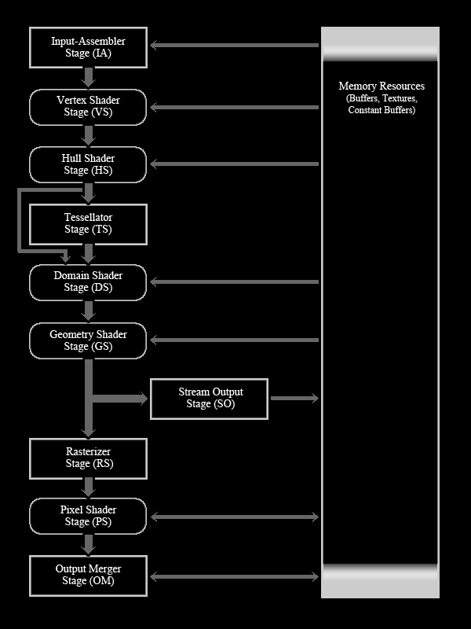

### IA:Input Assembler

读取几何数据、顶点和索引。然后,它使用数据创建几何图元,如traingles、square、lines和points,这些图元将被其他阶段输入和使用。

* 传入数据之前, 需要设置缓冲区并设置基本拓扑、输入布局和活动缓冲区。
  * 基本拓扑(图元拓扑?)(Primitive Topology): 顶点存储着物体的诸多信息(比如位置, 法线, 颜色等等),
将他们按照一定的规则组织便可以形成图形(这个规则被称为Primitive Topology).
    * <https://blog.csdn.net/u010333737/article/details/78556583>
* 先创建缓存: IA使用的两个缓冲区是顶点缓冲区和索引缓冲区
* 再创建输入布局对象: 告诉Direct3d我们的文本结构由什么组成,以及如何处理我们的顶点结构中的每个组件
  * 通过ID3D11Device::CreateInputLayout()实例化
* 创建一个顶点缓存
  * 通过ID3D11Device::CreateBuffer()实例化
* 绑定布局说明和顶点缓存
  * ID3D11DeviceContext::IASetVertexBuffers()与IASetInputLayout()
* 设置基本拓扑,以便IA知道如何使用顶点并制作诸如三角形或直线之类的基本元素。
  * 即, 输入六个顶点究竟是三条线, 还是两个独立三角形
  * ID3D11DeviceContext::IASetPrimitiveTopology()
* 管线准备就绪,通过ID3D11DeviceContext::Draw()传输图元

```c++
//The vertex Structure, 假设你的顶点结构中有位置、颜色两个元素
struct Vertex
{
    D3DXVECTOR3 pos;
    D3DXCOLOR   color;
};

//The input-layout description, 你的输入布局对象将会有两个元素分别对应位置与颜色
D3D11_INPUT_ELEMENT_DESC layout[] =
{
    {"POSITION", 0, DXGI_FORMAT_R32G32B32_FLOAT,
    0, 0, D3D11_INPUT_PER_VERTEX_DATA, 0},
    {"COLOR",    0, DXGI_FORMAT_R32G32B32A32_FLOAT,
    0, 12, D3D11_INPUT_PER_VERTEX_DATA, 0}
};
```

### VS:Vertex Shader

是可编程的着色器,通过VS可以执行诸如变换,缩放,照明,对纹理进行位移贴图之类的操作。

即使顶点没有变化, 也必须实现顶点着色器使得管道正常工作

管道中的顶点着色器通过类C++语言HLSL实现, 输入一个顶点返回一个顶点

### HS: Hull Shader

* 外壳着色器阶段(HS). 细化器阶段(TS)和域着色器阶段(DS)这三个新阶段共同协作以实现称为镶嵌(tesselation)的东西。
  * 作用是将一个图元（例如三角形或直线）分割成许多较小的部分. 从而以极快的速度增加模型的细节。
  * 在显示之前, 先将图元在GPU中创建, 然后直接映射到屏幕
    * 作用: 降低了在CPU 内存中创建的时间

### TS: Tessellator

从HS中获取数据, 对图元进行分割, 再将数据传给DS

### DS: Domain Shader

可编程着色器, 从HS获取顶点位置, 并接受TS的数据从而添加细节

如果仅仅是直接接受顶点位置, 那么并不会产生更多细节, 因为在三角形或直线的中心添加更多顶点不会增加任何细节

### GS: Geometry Shader

在顶点和片段着色器之间有一个可选的着色器. 叫做几何着色器(Geometry Shader)。
几何着色器以一个或多个表示为一个单独基本图形（primitive）的顶点作为输入. 比如可以是一个点或者三角形。
几何着色器在将这些顶点发送到下一个着色阶段之前. 可以将这些顶点转变为它认为合适的内容。
几何着色器有意思的地方在于它可以把（一个或多个）顶点转变为完全不同的基本图形（primitive）. 从而生成比原来多得多的顶点。

### SO: Stream Output

用于从管线中获取顶点数据. 特别是在没有GS的情况下

* 从SO输出的顶点数据始终以列表形式发送至内存, 永远不会发出不完整的图元
  * 不完整的图元: 例如一个只有两个顶点信息的三角形

### RS: Rasterization Stage

RS阶段获取发送给它的矢量信息（形状和图元）. 并通过在每个图元之间插入每个顶点的值将它们转换为像素。 它还处理裁剪. 基本上是裁剪屏幕视图之外的图元。

上述文字也解释了什么叫渲染(*Rasterization*)

### PS: Pixel Shader

* 该阶段进行计算并修改将在屏幕上看到的每个像素, 计算每个像素片段的最终颜色
* 与顶点着色器一样, 一一映射
  * 一个像素输入, 输出一个像素
* 像素片段: 是将被绘制到屏幕上的每个潜在像素

### OM: Output Merger

此阶段获取像素片段和深度/模板缓冲区. 并确定实际将哪些像素写入渲染目标

此阶段后, 将后置缓存映射到屏幕上

### 着色器的设置

d3d是一个状态机, 只能保存当前的状态和设定, 因此对着色器的设置需要在运行时(每次渲染材质之前)设置, 而不仅仅是初始化的时候设置

### 视图viewport

一个虚拟的窗口, 用来告知光栅化程序哪个部分是需要绘制给用户看到的

### 偏移量offset

数组的偏移量, 如ID3D11DeviceContext::Draw()中的第二个参数offset
比如开始绘制的顶点组v, 从第三个顶点开始绘制, 偏移量为2

### 效果文件(effect Files)

## Tutorial4: Color!

* 代码中的注释应该尽可能的加上改动的时间以及原因, 而不仅仅是在文档中写出, 增加可读性(会太复杂吗?)
  * 因此tutorial4以及之后的更新, 代码中均会有注释体现, 没有的就是前三个tutorial的更新

### x86与x64编译区别(解决issue)

-Todo[x]: x86与x64编译区别

<https://www.zhihu.com/question/303496588>
<https://www.cnblogs.com/xietianjiao/p/11599117.html>

* 定义:
  * x86: 将程序集编译为由兼容 x86 的 32 位公共语言运行库运行。
  * x64: 将程序集编译为由支持 AMD64 或 EM64T 指令集的计算机上的 64 位公共语言运行库运行。
* 选择不同后的行为(在 64 位 Windows 操作系统上)
  * 用 x86 编译的程序集将在 WOW64 下运行的 32 位 CLR 上执行
  * 用 x64 编译的程序集将在 64 位 CLR 上执行
* 设置正确编译不通过两个原因
  * 不兼容, 你编译的程序没有对应架构的库, 或者有对应的库, 但是用法稍有区别
  * 指针类型错误, 你程序对指针的加减, 或者指针强制转换有型别错误

## Tutorial5: Indices

### 索引

索引(index)的适用范围:

* 绘制几何图形
* 加载模型

功能: 减少加载重复的顶点, 有些顶点被共用, 会被多次写入缓存, 使用索引缓存可以避免

```c++
//没有索引缓存, 通过两个三角形构成一个长方形
vertex = {v1, v2, v3, v3, v2, v4};
//有索引缓存, 直接实现
vertex = {v1, v2, v3, v4};
index = {1, 2, 3, 3, 2, 4};
```

这就是第一次接触到面片, 绝大部分图形通过三角形进行模拟

### DWORD

表示unsigned long

## Tutorial6: Depth

创建深度/模板缓冲区(depth/stencil)和视图, 并且与OM阶段绑定

### 深度/模板视图

* 作用: 让管线的OM阶段检查渲染目标上所有像素细分的深度/模板值
  * 如一个球后面有一个正方体, 到达OM阶段时, 将像素片段深度值与该位置中已经存在的像素片段进行比较
    * 如果新的像素片段深度值小于已经存在的像素片段, 则将丢弃已经存在的像素片段, 并将新的像素片段保留在渲染目标上
    * 如果先渲染球再渲染正方体, 由于球在前面, 深度值更小, 丢弃新的正方体的像素片段
    * 所有几何图形绘制完毕后, 渲染目标剩余的像素就是最终显示到屏幕上的像素

### _DESC

是一个定义的描述, 就像前面定义后置缓存一样

## Tutorial7: World View and Local Spaces (static Camera)

### 本地(对象)空间(Local(object)space)

局部空间是相对于对象的空间, 对于一个正方形, 如果定义的顶点都基于全局对象, 那么进行其他顶点的定义就很困难

局部空间定义的顶点, 是相对于该对象中的其他顶点, 通常在包含3D对象的文件中定义, 该文件由3D建模程序创建

### 世界空间(World space)

世界空间用于在世界空间中对每个对象进行相对定位

* 世界空间是物体在三维场景中的位置、大小和旋转角度
* 所有对象围绕着中心点(0,0,0)
* 要创建世界空间矩阵, 我们需要对要创建世界空间矩阵的对象进行转换
* 使用世界空间矩阵, 可以将对象顶点从局部空间转换到世界空间

### 视图空间(view space)

* 基本上视作摄像空间: 摄像机固定在(0,0,0), 摄像机向下看z轴, 相机的向上方向是y轴
* 当我们进行转换时, 看起来相机在世界各地移动, 而实际上世界在移动, 而相机仍然在静止。
* 视图空间是通过创建一个矩阵来描述摄像机的位置、视图方向(目标)和向上(摄像机的y轴)来定义的

#### 投影空间(Projection space)

* 投影空间定义了3D场景中从相机的角度可以看到对象的区域: 对象进入则渲染, 对象退出则抛弃
* 由六个平面定义, 即近平面、远平面、顶、左、底和右平面
  * 将“投影空间”渲染为几何图形, 它将看起来像是一个顶端被切掉的金字塔。 金字塔的尖端将是相机的位置, 尖端被切除的位置将是近z平面, 金字塔的基础将是远z平面。
  * 近平面和远平面由浮点值定义, 其他四个平面由长宽比和FOV（以弧度表示的视场）定义。

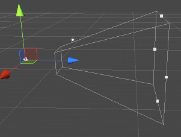

#### 视场角: FOV

在摄影学中, 视角(angle of view)是在一般环境中, 相机可以接收影像的角度范围, 也可以常被称为视野。

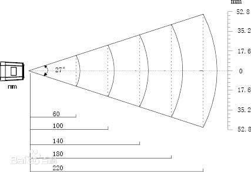

### 屏幕空间(Screen space)

也就是屏幕这个2D空间, 偏向于概念性的概念, 实际中无需定义

### 变换空间(Transforming space)

空间的变换涉及下面几步

* 局部空间中的对象顶点将发送到顶点着色器
  * 将一个顶点从一个空间转换到另一个空间, 将结果矩阵放到另一个称为WVP（世界视图投影）的矩阵中
  * 将WVP矩阵发送到效果文件中的常量缓冲区
  * VS将使用该缓冲区来转换对象顶点
* VS使用WVP传递的数据进行绘制
* 将顶点位置与WVP矩阵相乘, 从而转换空间
* 在渲染中删掉不在相机的视线范围内

### 常量缓冲区(Constant buffers)

* 是一种在效果文件中的结构体, 包含可以从游戏代码中更新的变量

```c++
cbuffer cbPerObject
{
    float4x4 WVP;
};
```

* 通过刷新率区别
  * 由于调用需要大量时间, 因此这样可以减少调用函数的次数
  * 分为下面几种
    * 逐场景(per scene): 如整个场景中不变的照明
    * 逐帧(per frame): 如太阳在天空中移动
    * 逐对象(per object): 如每个物体都有运动

### 测试单元

<https://www.zhihu.com/question/28729261>

### 齐次坐标(投影坐标)(Todo: 补充齐次坐标的数学知识)

* 齐次坐标就是将一个原本是n维的向量用一个n+1维向量来表示
  * 比如(x,y,z,w)构成的三维坐标, 点 (x, y, z) 表示为 (xw, yw, zw, w),
  且该点映射至平面上的点表示为 (xw, yw, zw)
  * 这样使得无穷远处的点更好的被定义
    * 如(1,2)被移至无穷远处, 在齐次坐标下表示为(1,2,1)->(1,2,0)

<https://www.cnblogs.com/lonelyxmas/p/10811299.html>----3D空间转2D屏幕

#### 透视除法(Perspective Division)

W 分量是投影仪到屏幕的距离, 用于3D物体投影至2D屏幕上, **透视法只是在矩阵变换后, 将齐次坐标中的w分量转换为1的专用名词**

* 当缩放坐标的 W 为1时, 坐标不会增大或缩小, 保持原有的大小。所以, 当 W=1, 不会影响到 X, Y, Z 分量的值
* W<1时, 3D物体会变小
* W>1时, 3D物体会变大
* W=0时, 代表无穷远处, 渲染成一个点
* W<0时, 物体上下水平翻转

也就是说, 最后转换"正确"后, 物体w分量一定为1

### dx11中向效果文件传输矩阵

必须发送矩阵的**转置**

## Tutorial8: Transformations

### World View Projection三者转换

针对issue"Todo in tutorial7 #9"
<https://blog.csdn.net/allenjiao/article/details/79557760>

* code中的worldSpace矩阵, 实际上是用作将局部矩阵(Local)转换为world的矩阵
* 同理view projection也一样

### 旋转(Rotation)

分别围绕x, y, z三轴进行旋转

```c++
     [ 1,      0,     0, 0]
Rx = [ 0, cos(r),sin(r), 0]
     [ 0,-sin(r),cos(r), 0]
     [ 0,      0,     0, 1]

XMMATRIX XMMatrixRotationX(
         FLOAT Angle    //Rotation angle in radians
)

     [cos(r), 0,-sin(r), 0]
Ry = [   0,   1,   0,    0]
     [sin(r), 0, cos(r), 0]
     [   0,   0,   0,    1]

XMMATRIX XMMatrixRotationY(
         FLOAT Angle    //Rotation angle in radians
)

     [ cos(r),sin(r), 0, 0]
Rz = [-sin(r),cos(r), 0, 0]
     [      0,     0, 1, 0]
     [      0,     0, 0, 1]

XMMATRIX XMMatrixRotationZ(
         FLOAT Angle    //Rotation angle in radians
)
//综合xyz
XMMATRIX XMMatrixRotationAxis(
         XMVECTOR Axis,    //Vector describing the axis of rotation
         FLOAT Angle    //Rotation angle in radians
)
```

### 平移转换

```c++
    [ 1, 0, 0, 0]
T = [ 0, 1, 0, 0]
    [ 0, 0, 1, 0]
    [mx,my,mz, 1]

XMMATRIX XMMatrixTranslation(
         FLOAT OffsetX,    // Units translated on the x-axis
         FLOAT OffsetY,    // Units translated on the y-axis
         FLOAT OffsetZ    // Units translated on the z-axis
)

```

### 索引缓存长度与顶点缓存长度

* 索引缓存需要通过片面数量\*3来得到总顶点数(包括重复顶点)
* 顶点缓存直接通过总顶点数(不包含重复顶点)
* 如一个正方体:
  * 索引:12\*3, 顶点:8

### 世界矩阵的计算

spaceWorld = Translation \* Rotation \* Scale

## Tutorial9: Render States

### 渲染状态(Render states)

封装可用于配置Direct3d的设置, 以下三个是我们能够自定义的不同状态

* ID3D11RasterizerState: 用于自定义管道的光栅化阶段
* ID3D11BlendState: 用于混合(blending)
* ID3D11DepthStencilState: 用于设置深度模板测试

## Tutorial10: Textures

### DirectX3D中纹理投影坐标

在Direct3D中, 我们使用2D(u,v)坐标系将纹理映射到对象上

* u, v都是相对图像的位置, 属于(0,1)
  * 即实际图像长度为256像素, 图像水平长度的一半也只有0.5

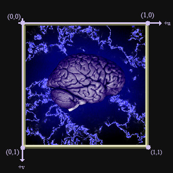

* 纹理坐标加倍, 则图像加倍

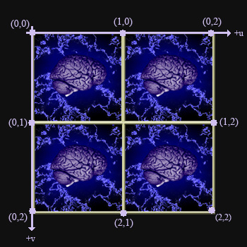

### 2D纹理与3D纹理

* 2D纹理只有(u,v)两个值用于定位
* 3D纹理在2D纹理的基础上增加一个w元素, 用于深度
  * 相当于xyz坐标对应的uvw

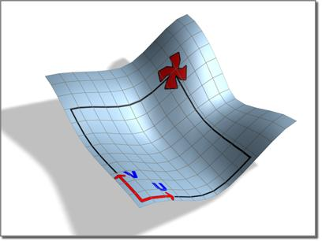

### 为每个片面顶点分离纹理坐标的原因

如果不是这样, 那么一个正方体八个顶点进行纹理贴图, 只有两个相对的面能够正确渲染

* 如顶+底或前+后或左+右, 无论如何总之不可能全部都正确渲染贴图

### mipmap

在三维计算机图形的贴图渲染的一个常用的技术

* Mipmap中每一个层级的小图都是主图的一个特定比例的缩小细节的复制品
* 当贴图被缩小或者只需要从远距离观看时, mipmap就会转换到适当的层级
* 因为mipmap贴图需要被读取的像素远少于普通贴图, 所以渲染的速度得到了提升, 而且操作的时间减少了, 因为mipmap的图片已经是做过抗锯齿处理的,
从而减少了实时渲染的负担, 放大和缩小也因为mipmap而变得更有效率
* 一般来说, 每个层级都是上一个层级的四分之一大小(长宽各少一半)

## Tutorial11: Blending

### 混合(blending)

<https://www.cnblogs.com/zhangbaochong/p/5634580.html>

根据深度的不同, 两个重叠的像素会有覆盖关系,
一旦混合功能开启, 当一个片段通过深度测试时, 并不是直接取代后缓冲的颜色, 而是通过一定的方法比例与之混合, 从而显示混合后的颜色

* 混合是通过获取渲染目标上已经存在的内容, 然后将当前对象的颜色与已经存在的内容进行混合来进行的
* 因此需要确保**首先渲染不透明对象**, 以便透明对象可以与不透明对象融合

### 混合方程(blending equation)

为了产生透视效果,它将获取渲染目标上透明原语后面的像素, 并将它们的颜色与当前透明原语像素混合

* (FC) - Final Color: 最终颜色
* (SP) - Source Pixel: 原像素
* (DP) - Destination Pixel: 目标像素
* (SBF) - Source Blend Factor: 原混合因子
* (DBF) - Destination Blend Factor: 目标混合因子
* (FA) - Final Alpha: 最终透明度
* (SA) - Source Alpha: 原透明度
* (DA) - Destination Alpha: 目标透明度
* (+) - Binaray Operator described below: 下列可能的计算

```c++
typedef enum D3D11_BLEND_OP {
  D3D11_BLEND_OP_ADD            = 1,
  D3D11_BLEND_OP_SUBTRACT       = 2,
  D3D11_BLEND_OP_REV_SUBTRACT   = 3,
  D3D11_BLEND_OP_MIN            = 4,
  D3D11_BLEND_OP_MAX            = 5
} D3D11_BLEND_OP;
```

有下面两个混合公式, 一个计算颜色另一个计算透明度

* $FC=SP\times SBF + DP \times DPF$
* $FA=SA*SBF+DA*DBF$

### 混合因子

```c++
typedef enum D3D11_BLEND {
  D3D11_BLEND_ZERO               = 1,//原数据(0,0,0,0)黑色
  D3D11_BLEND_ONE                = 2,//原数据(1,1,1,1)白色
  D3D11_BLEND_SRC_COLOR          = 3,//原数据来自像素着色器(RGB)
  D3D11_BLEND_INV_SRC_COLOR      = 4,//原数据来自像素着色器(RGB), 预处理1-RGB(用1逐个减像素着色器里的RGB)
  D3D11_BLEND_SRC_ALPHA          = 5,//数据为PS中的A值
  D3D11_BLEND_INV_SRC_ALPHA      = 6,//PS中的1-A值
  D3D11_BLEND_DEST_ALPHA         = 7,//数据来自已经存在render target上的A值
  D3D11_BLEND_INV_DEST_ALPHA     = 8,//数据来自已经存在render target上的1-A值
  D3D11_BLEND_DEST_COLOR         = 9,//数据来自已经存在render target上的RGB值
  D3D11_BLEND_INV_DEST_COLOR     = 10,//数据来自已经存在render target上的1- RGB值
  D3D11_BLEND_SRC_ALPHA_SAT      = 11,//数据来自源于PS着色器中的A,但是blend操作会把数据缩小到1及以下
  //数据来源于ID3D10Device::OMSetBlendState函数中设置的belnd factor
  D3D11_BLEND_BLEND_FACTOR       = 14,
  D3D11_BLEND_INV_BLEND_FACTOR   = 15,//同上,结果为1-factor
  //两个数据都是由PS产生,这个操作支持两个源数据颜色混合,而不是把一个PS上的数据与rendertarget混合
  D3D11_BLEND_SRC1_COLOR         = 16,
  D3D11_BLEND_INV_SRC1_COLOR     = 17,//同上,结果为1-RGB
  D3D11_BLEND_SRC1_ALPHA         = 18,//同上结果为A
  D3D11_BLEND_INV_SRC1_ALPHA     = 19//同上,结果为1-A
} D3D11_BLEND;
```

### Todo

TODO: RGB颜色矩阵转置为什么就会变成 1-RGB

#### A2C(alpha-to-coverage)

<http://www.zwqxin.com/archives/opengl/talk-about-alpha-to-coverage.html>

Alpha To Coverage(A2C)是一种经由流水线完成的“Alpha Test”

在使用了多重采样(Multi-sample)的场合下, 经由检测当前需要绘制的片段的alpha值来决定该片段在对应像素上的采样覆盖率

* 过去: 在渲染集合时, 背景部分需要被扣掉, 通过Alpha Test完成
  * Alpha Test: 后文提及
* 现在: 在可编程渲染管道下, 只要在fragment shader里抛弃掉不需要的片段就可以了

需要指定每个fragment的透明度——简单地sample一张纹理足矣,这样billboard每个像素就具有其依据图片的切实的透明度,非物件部分的alpha为0;物件主体部分alpha为1;主体的边缘部分则是0~1的渐变alpha值

#### 多重抗锯齿(MSAA: MultiSampling Anti-Aliasing)

Fragment Shader执行之后——Alpha To Coverage就在此时进行转换

一个fragment的Alpha值在0~1间,它对应着一个dither mask,还是以4XMSAA为例,这个dither mask也是xxxx的形式

### Alpha Test和Alpha Blending

<https://blog.csdn.net/candycat1992/article/details/41599167>

* Alpha Test: 是一种非0即1的强制方法, 只要一个像素的alpha不满足条件, 那么它就会被fragment shader舍弃
  * 结果要么完全透明, 即看不到, 要么完全不透明
* Alpha Blending: 它使用当前fragment的alpha作为混合因子, 来混合之前写入到缓存中颜色值
  * 注意: 我们需要保证物体的渲染顺序是从后往前, 并且关闭该半透明对象的ZWrite, 如果不关闭ZWrite, 那么在进行深度检测的时候,
  它背后的物体本来是可以透过它被我们看到的, 但由于深度检测时大于它的深度就被剔除了, 从而我们就看不到它后面的物体了

### 顺时针剔除与逆时针剔除(Counter clockwise culling)

* 为什么先逆时针剔除就能获得正方体背面
* Culling究竟是个啥?

<https://www.cnblogs.com/graphics/archive/2010/11/21/1883139.html>

#### Dx中正面背面的定义

按照顶点定义的先后顺序, 呈顺时针排列的顶点构成的三角形是frontface(以view space为参考), 如下图所示

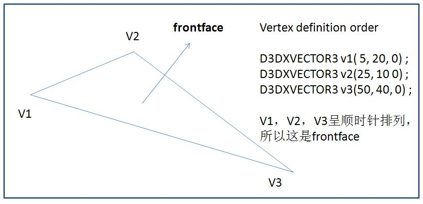

很显然, 根据图, 决定一个面是正面还是反面由两个因素

* 顶点定义的先后顺序
* 顶点的排列方向-顺时针或者逆时针(由顶点的位置坐标决定)

#### Culling(剔除)

* 目的: 为了提高渲染效率, 由于背面通常不可见, 因此允许用户使用下列三种模式剔除
  * D3DCULL_NONE - 不进行任何剔除
  * D3DCULL_CW  - 按顺时针方向进行剔除
  * D3DCULL_CCW - 按逆时针方向进行剔除(这是DX的默认剔除方式)
* 不做任何剔除, 则根据顶点集, 所有顶点构成的片面都将显示
* 顺时针剔除: 如上图10, 123点顺时针排列定义, 则该面会被剔除
* 逆时针: 同理

综上, 由于DX定义的就是顺时针排列的顶点构成正面, 因此剔除逆时针就是剔除背面

## Tutorial12: Pixel Clipping

需要一个背景透明的png图才能实现一个比较好的效果

### 裁剪(Clipping)

通常用于裁切在视图之外的巨型物体(微型物体裁切消耗的GPU资源可能超过画出之后再丢弃)

裁切像素之后, 就会禁止像素着色器继续处理, 并且不会将数据传递给渲染目标视图和深度模板缓冲

具体的裁切情况如下列网址:
<https://blog.csdn.net/l773575310/article/details/78433706>

### 裁剪与剔除(Clipping & Culling)

<https://zhuanlan.zhihu.com/p/97371838>

## Tutorial13: Simple Font

注意与之前的Blending结合, 且本章节是全网中少有的, 阐述如何通过Dx11渲染出字体

本章节将要实现, 通过在D3D11中使用D2D进行字体渲染

### Direct2D与缓存格式

Direct2D只支持BGRA格式, 而非之前的RGBA

### 表面共享(Surface Sharing)

通过Direct3D Device 使用Direct2D来渲染一个表面, 并将这个共享表面映射到覆盖整个屏幕空间的正方形上

### D3D10设备访问D3D11的纹理

由于不同D3D设备不能直接互相通信, 需要使用DXGI接口, 因此我们需要进行以下步骤

* 创建IDXGIResource, 其中的指针指向D3D11纹理
* 调用QueryInterface获得D3D11纹理中的IDXGIResource
* 创建一个句柄使得D3D10设备可以访问
* 通过IDXGIResource中的GetSharedHandle获得最终D3D11纹理的句柄

#### DXGI(DirectX Graphics Infrastructure)

是windows系统中用户模式下最底层的图形设备接口, 不管是Direct 2D 还是 Direct 3D都基于其上. 因此, DXGI 直接与硬件驱动打交道

#### 表面共享同步

* 创建转接器(Adapter)
* 创建D3D设备, 并与转接器绑定
* 绑定正确的驱动类型
* 绑定D3D11_CREATE_DEVICE_BGRA_SUPPORT数据类型
* 设置特性等级(feature level): D3D10_FEATURE_LEVEL_9_3

#### 共享纹理

* 设置正确的纹理格式: DXGI_FORMAT_B8G8R8A8_UNORM(2D纹理只支持BGRA格式)
* 设置MiscFlags(确定资源选项): D3D11_RESOURCE_MISC_SHARED_KEYEDMUTEX, 使得两个D3D设备能够共享该纹理

#### 带键信号量(Keyed Mutex)

对象: IDXGIKeyedMutex

通过IDXGIKeyedMutex\::AcquireSync与IDXGIKeyedMutex\::ReleaseSync进行信号量的PV操作

* 其中第一个变量都是key代表含义如下:
  * 第一次唤醒(acquire)必须key为0
  * 如果你在key=0唤醒,key=1释放, 那么下一个必须在1唤醒
  * 常常用于同步: 如果你想要ABC三个顺序, 那么设置如下
    * A acquire 0, release 1
    * B acquire 1. release 2
    * C acquire 2, release 0
  
<https://bobobobo.wordpress.com/2011/08/07/what-is-the-key-parameter-to-idxgikeyedmutexacquiresync-used-for/>

想要通过多个D3D设备访问, 需要通过IDXGIResource这个共享资源, 并通过IDXGISurface1对象访问共享资源的句柄

#### 共享资源(IDXGIResource)

通过该资源的句柄可以创建共享表面

#### 共享表面(IDXGISurface1)

通过IDXGISurface1存储共享资源的指针

### DPI(Dots Per Inch)

每一英寸长度输出点(图形学里就是像素点)

### 类型转换

<https://www.cnblogs.com/evenleee/p/10382335.html>

#### static_cast<类型说明符>(表达式）

* 类似C风格的强制转换, 进行无条件转换, 静态类型转换
* 基本数据类型转换, enum, struct, int, char, float等
* static_cast不能进行无关类型（如非基类和子类）指针之间的转换
* 把任何类型的表达式转换成void类型

```c++
double d = static_cast<double>(n);     //基本类型转换
int *pn = &n;
double *d = static_cast<double*>(&n);  //无关类型转换, 编译错误
void *p = static_cast<void*>(pn);
```

#### dynamic_cast<类型说明符>(表达式）

条件转换, 动态类型转换, 运行时检查类型安全（转换失败返回NULL）

* 必须有虚函数, 保证多态性
* 相同基类不同子类之间的交叉转换, 但结果返回NULL

```c++
class Base {
public:
    int _i;
    virtual void foo() {}; //基类必须有虚函数。保持多态特性才能使用dynamic_cast
};

class Sub : public Base {
public:
    char *_name[100];
    void Bar() {};
};
Base* pb = new Sub();
Sub* ps1 = static_cast<Sub*>(pb);  //子类->父类，静态类型转换，正确但不推荐(非基类)
Sub* ps2 = dynamic_cast<Sub*>(pb); //子类->父类，动态类型转换，正确

Base* pb2 = new Base();
Sub* ps21 = static_cast<Sub*>(pb2); //父类->子类，静态类型转换，危险！访问子类_name成员越界
Sub* ps22 = dynamic_cast<Sub*>(pb2);//父类->子类，动态类型转换，安全，但结果为NULL
```

#### const_cast<类型说明符>(表达式）

去掉类型的const或volatile属性

```c++
const T a;
//a.i = 10;  //直接修改const类型, 编译错误
T &b = const_cast<T&>(a);
b.i = 10;
```

#### reinterpret_cast<类型说明符>(表达式）

<https://zhuanlan.zhihu.com/p/33040213>

不会改变括号中运算对象的值, 而是对该对象从位模式上进行重新解释

* 转换类型必须是指针
* 在比特级别上进行转换, 可以把一个指针转换成一个整数, 也可以把一个整数转换成一个指针（先把一个指针转换成一个整数,
  在把该整数转换成原类型的指针, 还可以得到原先的指针值）, 但不能将非32bit的实例转成指针
* 最普通的用途就是在函数指针类型之间进行转换

举个例子: 即, 原本是类型A的地址0xAA 变成了 类型B的地址0xAA

```c++
int num = 0x00636261;//用16进制表示32位int，0x61是字符'a'的ASCII码
int * pnum = &num;//pnum的值为内存地址, 指向的内容为636261
char * pstr = reinterpret_cast<char *>(pnum);//pstr的值为相同的内存地址, 指向的内容为0x00636261对应的字符abc
```

## Tutorial14: High Resolution Timer

### MSVC中的大数

通常在ACM中会遇到, 要表达一个会使得int爆栈的数(例如上百亿), 常规的32位int只能存放40亿左右

一般这种情况需要使用64位扩展(或者更高128位), 而针对这些扩展, 不同的编译器的支持情况也不同, 以下仅仅根据微软官网的扩展进行参考

```c++
__int8 nSmall;      // Declares 8-bit integer 与char同义, 同时也是_int8
__int16 nMedium;    // Declares 16-bit integer 与short同义, _int16
__int32 nLarge;     // Declares 32-bit integer 与int同义, _int32
__int64 nHuge;      // Declares 64-bit integer 与long同义, _int64
```

### 为什么教程中的面向对象概念如此浅薄

如果使用对象封装不利于观察分析底层运行情况

## Tutorial15: Simple Lighting

### 光的种类

#### 环境光(Ambient)

* 使得未被光源直射的部分不会变成黑色(场景中的最低亮度保证)
* 现实中: 受到物体表面的反射照亮整个环境
* 编程中: 实时渲染无法负担, 因此全局给一个对光线的环境颜色和材质的漫反射颜色进行了逐分量乘法得到的值

#### 漫反射(Diffuse)

假设光在物体表面被均匀反射(通常与物体材质有关), 这样无论摄像机在哪, 进入摄像机的光线数量相同

通过朗伯余弦定律(lambert's cosine law)得到:

* 该像素是否直接受到光照射
* 光照值

#### 镜面反射(Specular)

"光追"的开销大头, 光滑表面直接将光反射进入摄像机

#### 放射光(Emissive)

类似于灯泡附近的辉光, **并不是**灯泡自己发出的光

### 光源种类

#### 平行光源(Directional Lights & Parallel Lights)

* 没有来源, 只有方向与颜色

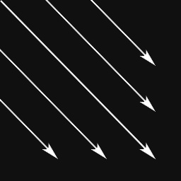

#### 点光源(Point Lights)

* 一个光源位置, 衰退点(或衰退范围), 颜色
* 无需光照方向(所有方向都有)
* 与平行光源的区别:
  * **有衰退点**
  * 对于平行光源, 所有物体都通过一个光矢量来计算
  * 对于点光源, 不同物体的光矢量不同
    * 举例: 点光源在中心, 左右两侧的物体的右边与左边被分别照亮, 而平行光源则使得他们同一侧被照亮

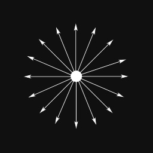

#### 聚点光源(Spotlights)

* 方向, 光源位置, 颜色, 两个夹角, 衰退点
* 由于信息众多, 因此计算量巨大
* 如图有两个锥面: 中间锥面更亮, 外侧锥面更暗, 最外侧最暗
* 最内侧可以看作是光线的镜面反射


### 法线(Normals)

定义面的朝向, 此处用来确定表面是否在光线中以及接受到光线的数量

由于转换世界空间中的顶点会使得其法向量不再为单位向量, 因此使用normalize这个函数进行修正

#### 顶点法线(Vertex Normals)

创建顶点时一起创建顶点法线

通过顶点法线来得知该像素点所接受的光线

通过**平均法线**(normal averaging)使得表面更加平滑, 如果不使用平均法线, 则每个三角片面将被点亮, 使得表面不平坦

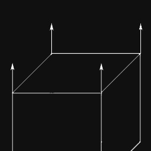

#### 面法线(Face Normals)

通常不主动创建面法线, 通过平均顶点法线来创建面法线, 描述面指向的方向

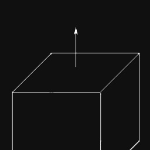

#### 平均法线(Normal Averaging)

使用该顶点获取每个面的法线, 然后对其求平均值, 这样光线将逐渐遍历每个面, 而不是一次遍及整个面
